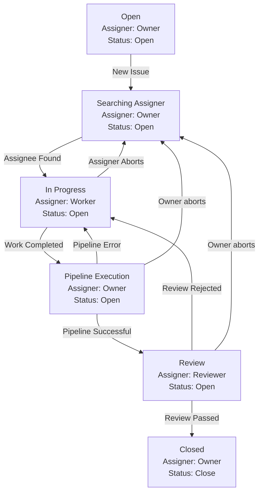

## Basic Customization Guide
A clearer understanding of `xia-gpt` design can be beneficial before delving into customization.

### Design Thinking
All activities could be represented by state-to-state flow.
* State is represented as `KnowledgeMap` which consists of a lot of `KnowledgeNode` with their values
* state-to-state must be performed by `Actor`. The `KnowledgeNode` has no ability to change itself
* ONLY two reasons will lead to state-to-state failure: Inadequate context or weak inferential capabilities.
  * `Campaign`, `Mission` and `Task` could help to reducing inferential difficulty while keeping the necessary context
  * `Actor` could escalade to other `Actor` to get more inferential capacities. Human is also a kind of `Actor`
* ONLY two criteria for judging a state-to-state failure: subjective reject or objective reject
  * Subjective reject means the `Actor` refuses the target state. It is controlled by `Review`
  * Objective reject means the target state isn't logically consistent. It is controlled by `Validation` 

### Main customization steps

### Customization File locations
All files are under `templates` directory. Different module will load the file from their related subdirectory.

### Task
`Task` is a reusable unit for a state change. 
It is context irrelevant and has the following sections:
* `format`: gives an example of expected `KnowledgeNode` format
* `guide`, `optimizer`: gives the instruction how the `KnowledgeNode` should be changed. 
* Each section is presented as a block by following jinja2 format.

### Mission
`Mission` is smallest executable unit. It collects necessary context to perform state-to-state change by a group of `Task`

### 
